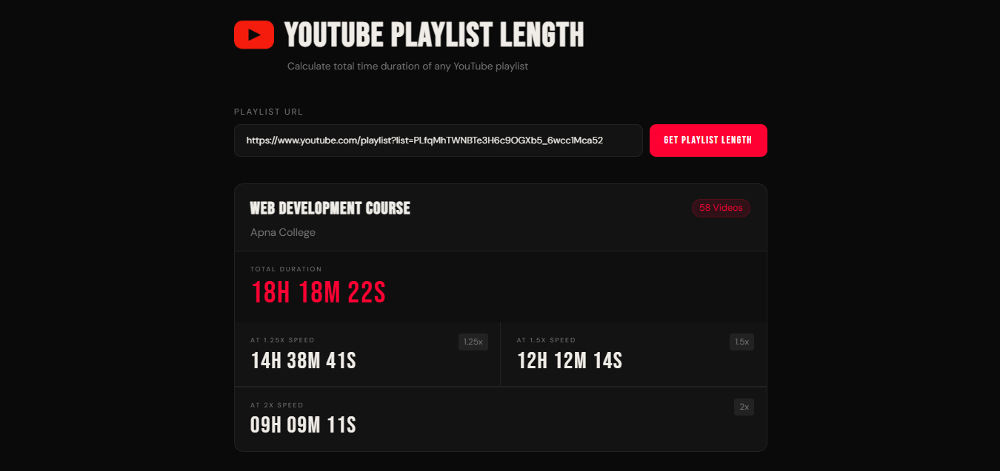

# Youtube Playlist length

This app calculates the total time of any YouTube playlist.
It also shows how long the playlist will take if you watch it at different speeds (1.25x, 1.5x, 2x).

Users just need to enter the playlist URL, and the app gets all the video times using the YouTube Data API.

## Features

* Enter any YouTube playlist URL and get the total time.
* Calculates durations for 1.25x, 1.5x and 2x speeds. 
* Shows playlist details:
    * Playlist name
    * creator / channel name
    * Total number of videos
* Easy to read time formating (HH MM SS)
* Responsive design for mobile and Desktop.

## Tech Used
- HTML
- CSS
- JavaScript
- YouTube Data API v3
- Google Fonts

## How To Use

1. Open the app in your browser (GitHub pages link or locally).
2. Enter a YouTube playlist URL in the input box.
3. Click"Get playlist Length".
4. Wait for the results to appear in the Result section.

## Screenshot

## Future Improvements
* <!-- Add error handling for invalid playlist URLs. --> done
* Allow multiple playlists calculation at once.
* Include dark/light theme toggle.
* Improve loading indicators while fetching videos.
* convert this app to React in the future.